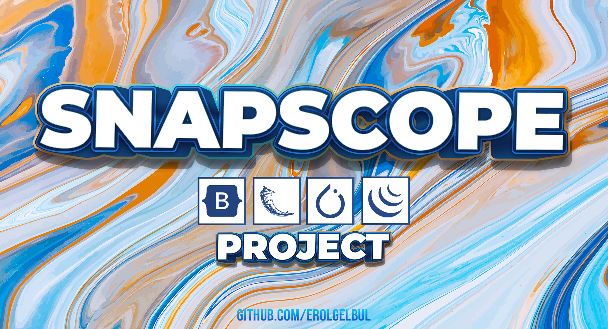
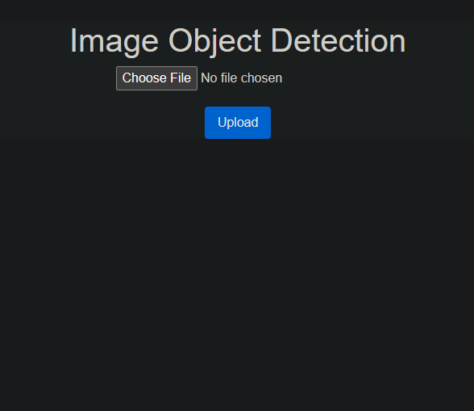
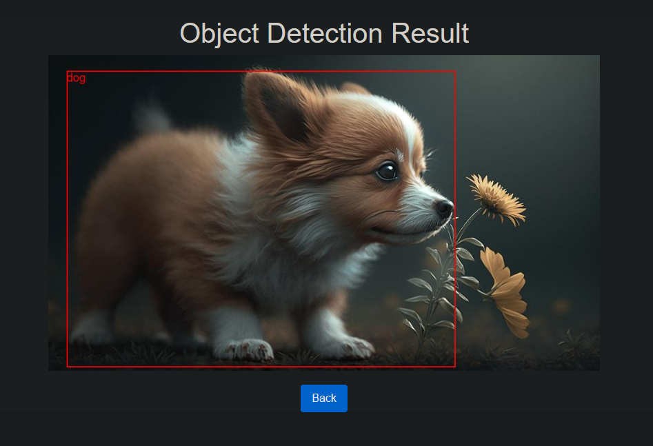
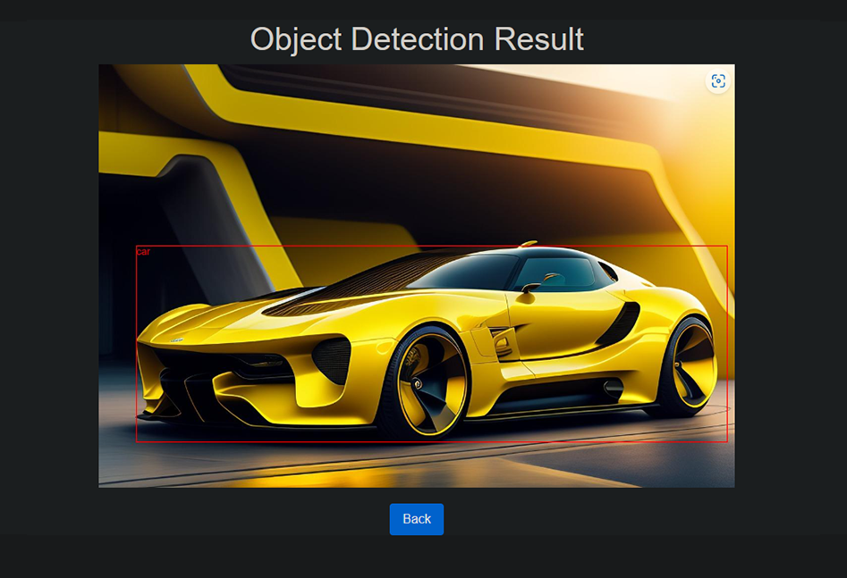
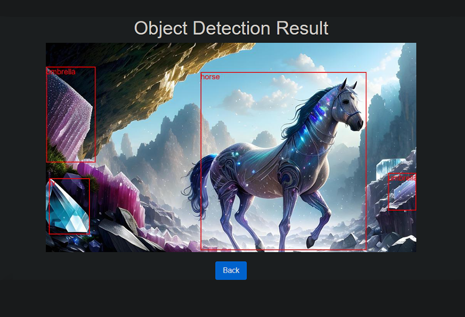

<div id="top"></div>

<div style="text-align:center"></div>

## 1. Overview

This Flask application allows users to upload images and perform object
detection using a pre-trained Faster R-CNN model with a ResNet-50 FPN backbone.
Detected objects are outlined in red bounding boxes, and their labels are
displayed on the image. The processed image is then displayed to the user.

### 1.1 Front-end

<p align="center">
  
</p>

### 1.2 Dog example:

<p align="center">
  
</p>

> If the font size is small for the user, there is a feature inside the app.py
> where the developer can manually increase it.

### 1.3 Car example:

<p align="center">
  
</p>

### 1.4 Horse example:

<p align="center">
  
</p>

## 2. File Structure

```bash
/flask-image-object-detection
---static/
---templates/
------index.html
------result.html
---app.py
---images/
```

### 2.1 app.py

This is the main application file, which contains the Flask routes and logic for
object detection using the Faster R-CNN model. The following libraries are
imported:


io, os, and uuid for handling image I/O and generating unique filenames
PIL (Python Imaging Library) for image manipulation
Flask, request, jsonify, render_template, and url_for for handling HTTP requests
and rendering HTML templates

torchvision.transforms for image preprocessing
torchvision.models for loading the pre-trained model
The application has three routes:

<ins>/ (GET):</ins> The root route that renders the index.html template for the user to
upload an image.

<ins>/detect (POST):</ins> This route handles image uploads, performs object detection on
the uploaded image, and returns the processed image URL to the browser.

<ins>/result/path:image_url (GET):</ins> This route renders the result.html template,
displaying the processed image with detected objects.


### 2.2 templates/index.html

This file contains the HTML template for the image upload page. It has a form
for users to select and upload an image. The form's action attribute is set to
/detect, and the method attribute is set to "POST".

### 2.3 templates/result.html

This file contains the HTML template for the object detection result page. It
displays the processed image with bounding boxes and labels. It also has a
"Back" button, which takes the user back to the image upload page.

## 3. Usage

1. Install the required dependencies:
   
```bash
pip install -r requirements.txt
```

2. Run the Flask application:

```bash
python app.py
```

3. Open a web browser and navigate to http://localhost:5000 to use the application.


## 4. Customization

You can adjust the object detection threshold in the detect_objects function by
changing the value of the score variable. For example, to increase the threshold
to 0.7, change the line:

```python
if score > 0.5:
```

to:

```python
if score > 0.7:
```

## 5. Copyright Disclaimer

This project utilizes AI-generated images for the purpose of object detection
and demonstration. These images are solely intended for educational and personal
use, and they are not to be sold or used for any commercial purposes. Any use of
these AI-generated images must adhere to applicable copyright and intellectual
property laws.


The creator of this project do not claim any rights over the
AI-generated images used in the project. The responsibility for the proper usage
and attribution of these images lies with the users of this project. Users are
urged to ensure compliance with copyright laws and respect the rights of the
original content creators.


In case of any concerns or disputes regarding the use of AI-generated images
within this project, please contact the project [owner](erolgelbul.com).


## 6. Future Work

- Performance improvements.

<p align="right">(<a href="#top">back to top</a>)</p>

## 7. Contributing

If you would like to add any extra features to the optimisation simulation, feel free to fork and create a pull request. Thank you!

1. Fork the Project
2. Create your Feature Branch (`git checkout -b feature/AmazingFeature`)
3. Commit your Changes (`git commit -m 'Add some AmazingFeature'`)
4. Push to the Branch (`git push origin feature/AmazingFeature`)
5. Open a Pull Request

<p align="right">(<a href="#top">back to top</a>)</p>


<!-- CONTACT -->
## 8. Contact

Erol Gelbul - [Website](http://www.erolgelbul.com)

Project Link: [SnapScope](https://github.com/ErolGelbul/snapscope)

<p align="right">(<a href="#top">back to top</a>)</p>